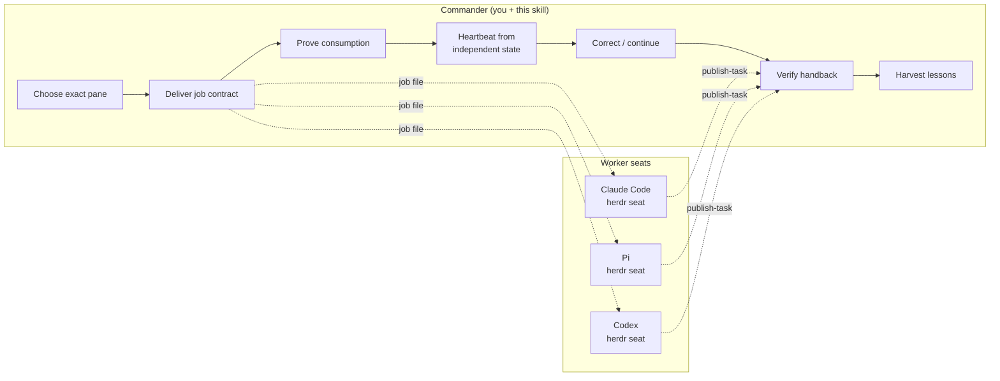

# fleet-commander

**Field-tested command discipline for coding-agent fleets.** fleet-commander is
an operational skillbook that turns a single human operator into a reliable fleet
commander running multiple AI coding agents across herdr workspaces, remote SSH
seats, and legacy tmux panes. Every rule earned its place by surviving a real
incident — each carries the date it was forged.

Built for Claude Code, Pi, Codex, and omp workers. Tested daily in production
fleets since July 2026.

## Why this exists

Running one coding agent is easy. Running five at once — each on its own branch,
in its own pane, on its own task — is where things break: a paste gets swallowed
by a mode transition, a worker silently edits the wrong checkout, a "done"
notification arrives but the artifact is empty. fleet-commander encodes the
judgment calls that prevent these failures into repeatable checks any mid-tier
model can execute.

**What makes it different:** this is not a theory document. Every guardrail
traces to a dated production incident. When a rule says "never do X (2026-07-18:
...)", that date is when someone did X and paid for it.

## How it works



The commander loop is one line:

> choose an exact pane → deliver a self-contained job → prove it started →
> heartbeat from independent state → correct/continue safely → verify handback
> and clean up

## Quickstart

### Prerequisites

- A POSIX host with **herdr** (macOS, Linux, or WSL2) — the standing seat fabric
- At least one supported agent: [Claude Code](https://docs.anthropic.com/en/docs/claude-code),
  [Pi](https://pi.ai), [Codex](https://openai.com/codex), or omp
- tmux is supported for legacy seats but no longer required as the primary fabric

### Install as a Claude Code skill

```bash
# From the Claude Code CLI
npx skills use tenmomo/fleet-commander
```

Or clone directly:

```bash
git clone https://github.com/tenmomo/fleet-commander.git
# Point your agent's skill loader at this directory
```

### First fleet

1. Load [`SKILL.md`](SKILL.md) into your commander session.
2. Read the worker adapter for your agent before launching it:
   - [`HERDR-WORKERS.md`](HERDR-WORKERS.md) for herdr workspaces (the standing fabric)
   - [`PI-WORKERS.md`](PI-WORKERS.md) for Pi workers
   - [`CODEX-WORKERS.md`](CODEX-WORKERS.md) for Codex workers
3. Write a self-contained job contract under `~/fleet/<concern>/jobs/`.
4. Register the task with the durable ledger:

   ```bash
   python3 <skill-dir>/scripts/return-channel.py register \
     --task my-task-001 --worker-pane w4:p1 --reply-to w4:p0 \
     --owned-paths src/feature --result-paths out/REPORT.md
   ```

5. Deliver the contract to the worker pane, prove consumption, and heartbeat.
6. Worker finishes with `publish-task`; verify the artifact, then move the
   ledger through `verified` → `acked`.

## What's in the box

| File | Purpose |
|------|---------|
| [`SKILL.md`](SKILL.md) | Core commander loop — targeting, dispatch, heartbeat, verification, guardrails |
| [`HERDR-WORKERS.md`](HERDR-WORKERS.md) | herdr workspace launch, observation, and teardown |
| [`PI-WORKERS.md`](PI-WORKERS.md) | Pi agent launch, delivery, and heartbeat mechanics |
| [`CODEX-WORKERS.md`](CODEX-WORKERS.md) | Codex commissioning gate, context counters, quota management |
| [`HARVEST.md`](HARVEST.md) | Field-observation capture and promotion workflow |
| [`SLASH-COMMANDS.md`](SLASH-COMMANDS.md) | Four-harness slash command table and cross-harness comparison |
| [`TMUX-ARCHIVE.md`](TMUX-ARCHIVE.md) | Archived tmux fabric mechanics for legacy seats |
| [`scripts/return-channel.py`](scripts/return-channel.py) | Durable mailbox and typed task ledger with flock locking |
| [`scripts/usage.sh`](scripts/usage.sh) | Headless quota reader via Claude Code OAuth usage API |
| [`CHANGELOG.md`](CHANGELOG.md) | Public release history |

## What v3.0 changes

v3.0.0 is a major release. The key changes:

- **herdr is the sole standing fabric.** Every seat — commander and worker, any
  harness — runs in a herdr workspace. tmux mechanics are archived to
  [`TMUX-ARCHIVE.md`](TMUX-ARCHIVE.md) and supported only when the owner
  explicitly names a tmux seat.
- **Fabric-detected notify wire.** The return-channel helper now detects the
  pane token shape: herdr pane ids (`wX:pY`) are woken over the herdr socket
  API; everything else takes the legacy tmux wire. Both fabrics work end to end.
- **SLASH-COMMANDS.md.** A field-tested table of every slash command across
  four harnesses (Claude Code 103 / Pi 22 / Codex 45 / omp 61), plus a
  cross-harness comparison matrix and herdr CLI verb reference.
- **usage.sh.** A headless quota reader that pulls live usage from the Claude
  Code OAuth API without injecting `/usage` into a seat.
- **Judge-seat wave doctrine (§6b).** Eight rules for running writer×N + judge×1
  batch waves: advisory-first process claims, SHA-pinned baselines, proxy
  execution with attribution, instrument-chain provenance, and batch-remainder
  broadcast protocol.
- **Verification hardening.** Self-run hard criteria (your standards are your
  blind spot), independent checker must be at least as strong as the checked
  item, pipeline exit-code laundering, "keep current state" anchored to
  pre-change snapshots, interface-file format checks before batch feed, and
  regex banned for structured-output counting.

## Key concepts

- **Commander vs. Worker** — The commander steers; workers produce artifacts.
  The commander never does the worker's job in its pane.
- **Self-contained contracts** — Every job file carries its full context: cwd,
  owned paths, outputs, constraints, stop conditions, and return address.
- **Artifact-anchored completion** — A task is done when the artifact exists and
  verifies, not when the worker says "done."
- **Durable task ledger** — `return-channel.py` tracks task state with
  append-only events, lease expiry, artifact hashing, and owned-path conflict
  detection.
- **Harvest loop** — Every surprise becomes a dated rule so the next run starts
  better. The skillbook is its own cross-run memory.

## FAQ

**Q: Does this require a specific AI provider?**
No. The skill is provider-agnostic at the commander level. Worker adapters exist
for Claude Code, Pi, Codex, and omp, but any agent that accepts text input in a
terminal pane can be commanded.

**Q: Can I use this without herdr?**
herdr is the primary seat fabric since v3.0. tmux is archived but still
supported — read [`TMUX-ARCHIVE.md`](TMUX-ARCHIVE.md) for legacy tmux
mechanics. Remote SSH boxes work as worker targets inside any fabric's pane.
Native Windows without WSL is not supported as a commander host.

**Q: How is this different from multi-agent frameworks like CrewAI or AutoGen?**
Those frameworks orchestrate agents programmatically via APIs. fleet-commander
operates at the terminal level — it commands real agent sessions the same way a
human operator would, using herdr's `agent prompt` / `pane send-text` (or tmux
`send-keys` for legacy seats). This means it works with any agent that has a
CLI, requires no API integration, and the human operator can inspect and
intervene at any point.

**Q: What does "field-tested" mean concretely?**
Every rule in the skillbook carries a date — that's the day the rule was forged
from a real incident. For example, the paste-swallow guard (2026-07-21) exists
because `/clear` silently ate a job contract twice. The naming convention rule
(2026-07-31) exists because a tmux session with a dot in its name became
unreachable.

**Q: Is the return-channel.py script required?**
It's strongly recommended. Without it you lose durable task tracking, artifact
verification, owned-path conflict detection, and the structured handback
protocol. But the commander loop principles work even with manual tracking.

## Release history

See [`CHANGELOG.md`](CHANGELOG.md) for the full history. Current: **v3.0.0**
(2026-08-20).

- **v3.0.0** — herdr sole standing fabric, tmux archived, fabric-detected
  notify wire, SLASH-COMMANDS table, usage.sh quota reader, judge-seat wave
  doctrine, seven-file book.
- **v2.1.0** — Codex seat adapter, herdr close-on-ack, naming convention,
  ctx-probe, five-file book structure.
- **v2.0.0** — Typed durable task ledger with 37 tests, publish-task atomic
  finish, owned-path conflict gate.
- **v1.0.0** — First public edition. Commander loop, herdr and Pi adapters,
  harvest workflow, return-channel helper.

## Contributing

See [`CONTRIBUTING.md`](CONTRIBUTING.md).

## License

[MIT](LICENSE) — Copyright (c) 2026 TENMOMO LLC.
